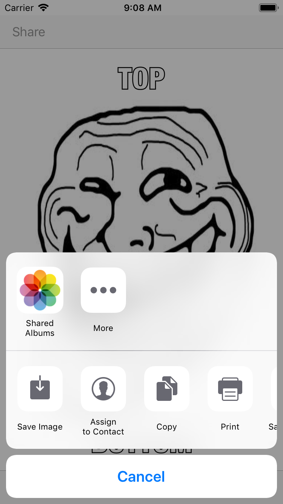

# MemeME
Memes creation application (IOS application, Swift)

## What the app do:
The App that enables a user to take a picture, and add text at the top and bottom to form a meme. The user will be able to share the photo on Facebook and Twitter and also by SMS or email.

## App screenshots:
   
